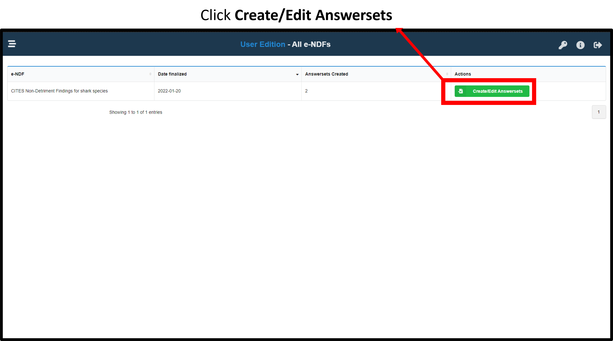
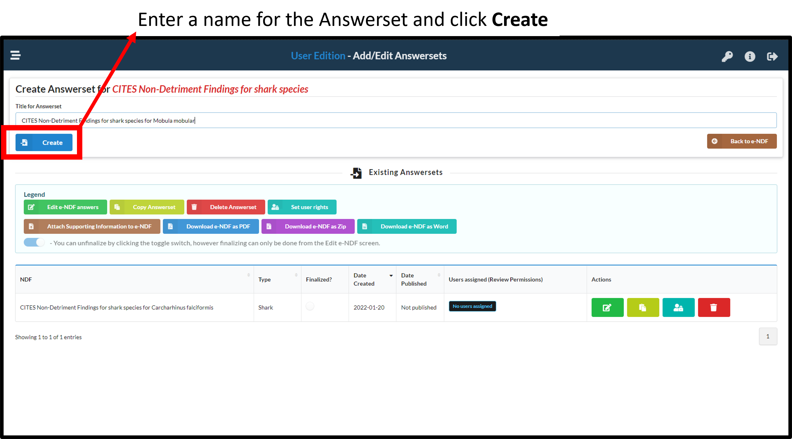
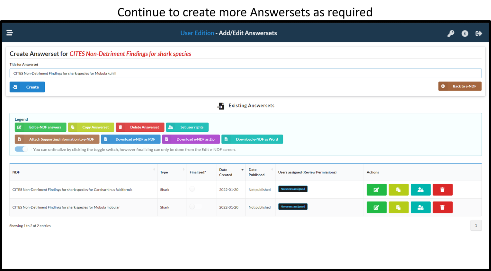

# Developing an CITES NDF
To begin an e-NDF, the NDF admin needs to initialise an Answerset. The steps involved are illustrated below.

## Select and NDF to fill {#startanswerset}
Select an NDF to create an Answerset
```{r echo=FALSE, out.width='80%',fig.align='center'}

```

## Name the Answerset
Edit the name of the Answerset - ensure the name is descriptive and clear (eg. 'NDF for silky sharks - 2022')
```{r echo=FALSE, out.width='80%',fig.align='center'}

```

## Create Answersets as needed
```{r echo=FALSE, out.width='80%',fig.align='center'}

```

## Next steps
Once an Answerset are created, the NDF admin can proceed with [assigning users to enter data](#assignRights) into the respective NDF. 

**Note:***If users and usernames have not been created, the admin will first need to [create users](#createUsers)*.