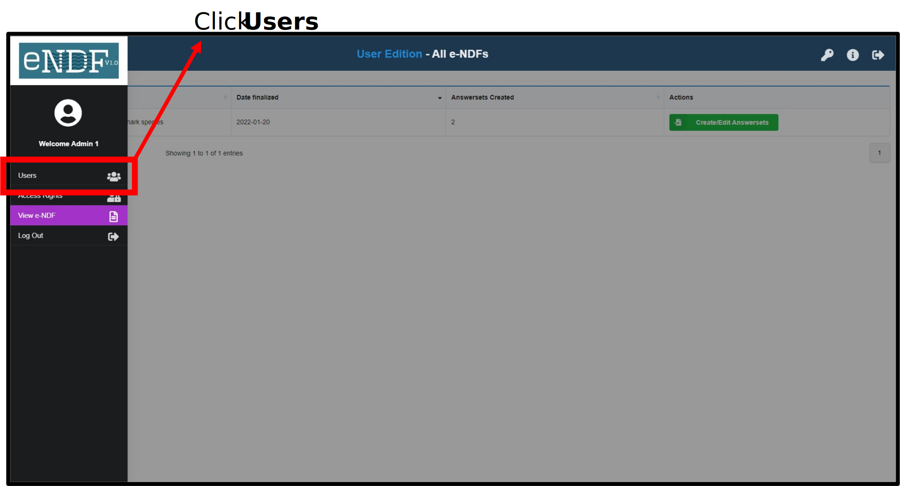

# Creating users {#createUsers}
An e-NDF admin can create multiple users to fill in an e-NDF. The admin can also assign access rights to specific questions/sections/steps of an e-NDF to each user. The steps involved are illustrated below.

## Click the side bar 
```{r echo=FALSE, out.width='80%',fig.align='center'}

```

---

## Navigate to the **Users** screen
```{r echo=FALSE, out.width='80%',fig.align='center'}

```

---

## Enter user details
Provide the name, a user id and a temporary password for the user. The user will be prompted to change this password on first login. If the user loses their password, they can contact the admin to reset their password to a new temporary password.

**Admins can provide the temporary passwords to users directly.**
```{r echo=FALSE, out.width='80%',fig.align='center'}
knitr::include_graphics('images/User3.svg')
```

---

## Add more users as needed
```{r echo=FALSE, out.width='80%',fig.align='center'}

```

---

## Next steps
Users can be [given access](#assignRights) to fill in one or more Answersets.

**Note:***If Answersets have not been created, the admin will first need to [create Answersets](#startanswerset)*.