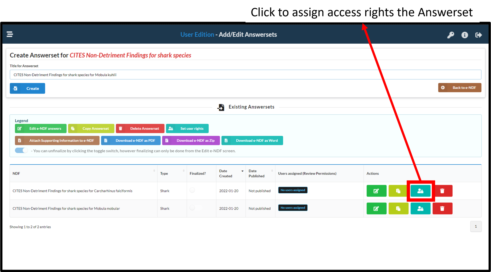
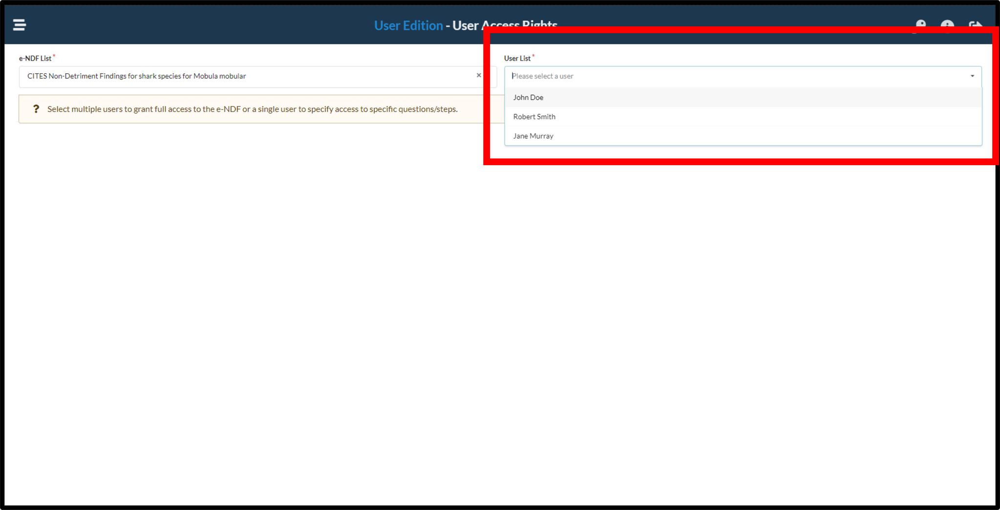
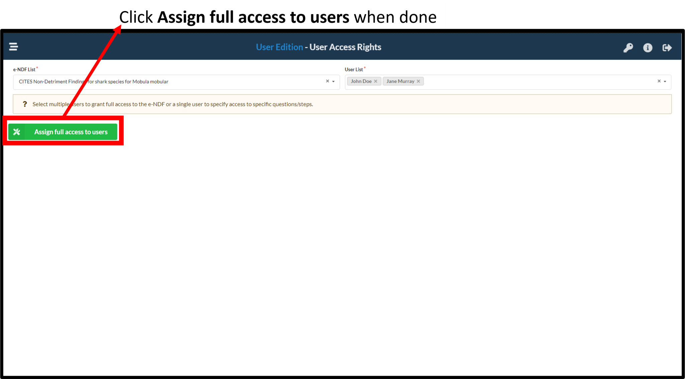
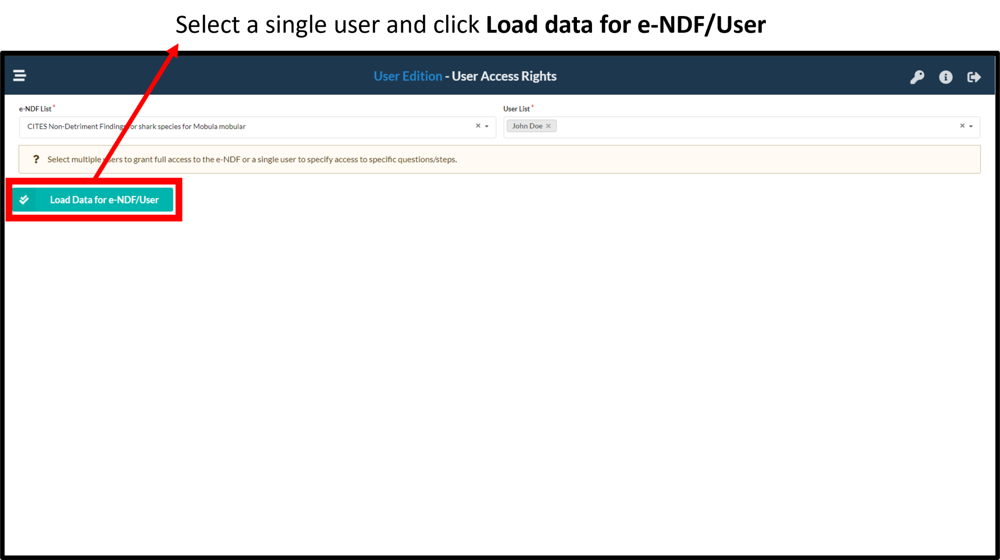
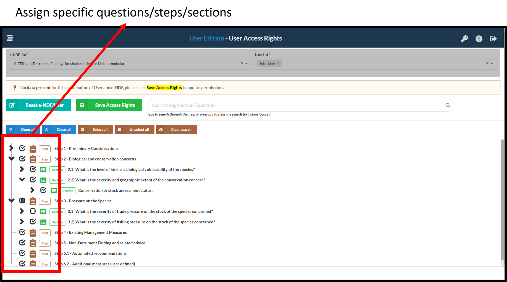
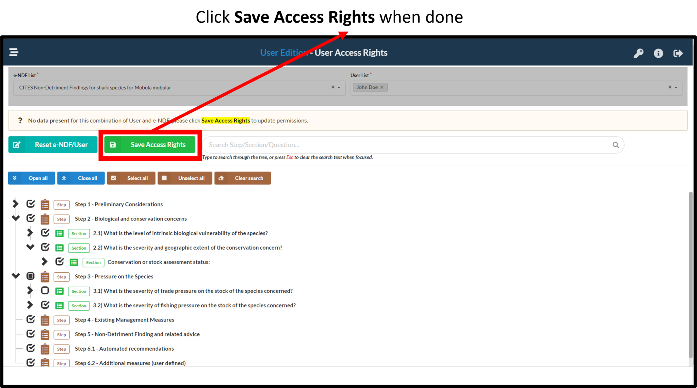

# Assigning access rights {#assignRights}
NDF admins can assign access rights to users to 

1. [The entire e-NDF](#multiuser) OR

2. [A specific set of questions/sections/steps](#singleuser) as needed.

# Access to the entire e-NDF for multiple users {#multiuser}
This functionality provides a quick way to grant multiple users access to the entire NDF. Access can be granted after [Answersets have been created](#startanswerset).

## Click on add users
Click on the marked icon to select users
```{r echo=FALSE, out.width='80%',fig.align='center'}

```

---

## Select multiple users as needed
```{r echo=FALSE, out.width='80%',fig.align='center'}

```

---

## Confirm access assignment
```{r echo=FALSE, out.width='80%',fig.align='center'}

```

# Access to specific parts for users {#singleuser}
This functionality provides a method to provide finetuned access (to question level) for users of the e-NDF. Access can be granted after [Answersets have been created](#startanswerset).

## Click on add users
Click on the marked icon to add users
```{r echo=FALSE, out.width='80%',fig.align='center'}

```

---

## Select a single user as needed
```{r echo=FALSE, out.width='80%',fig.align='center'}

```

---

## Assign access rights
Select the relevant parts of the e-NDF to be assigned to the user by clicking through the e-NDF tree.
```{r echo=FALSE, out.width='80%',fig.align='center'}

```

---

## Confirm access assignment
```{r echo=FALSE, out.width='80%',fig.align='center'}

```