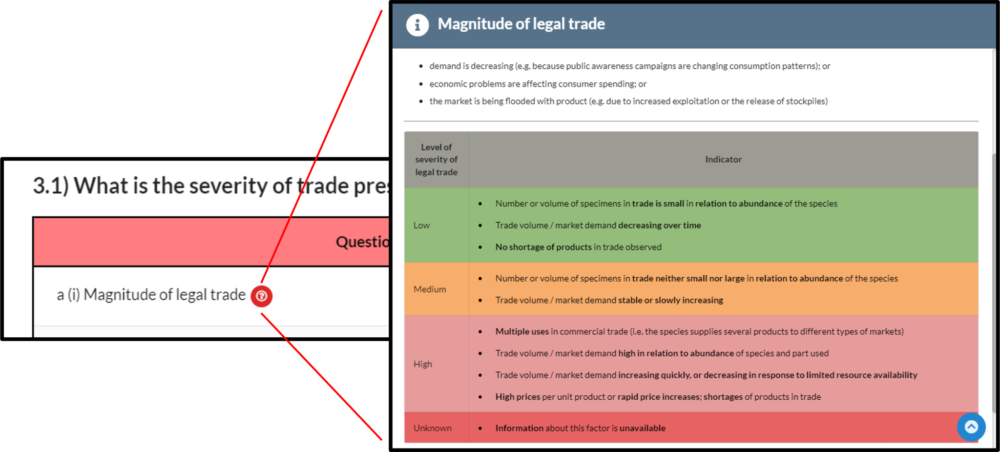
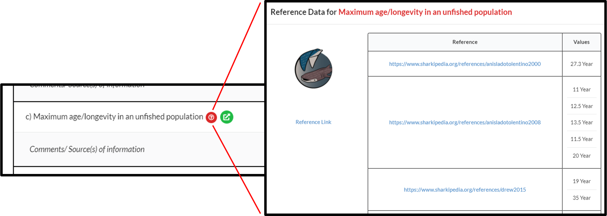
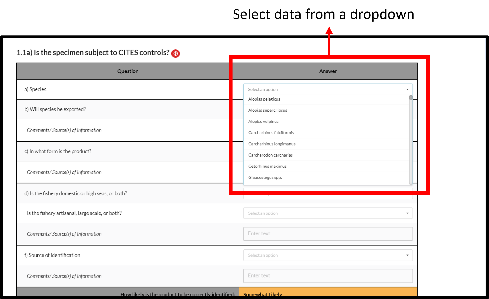
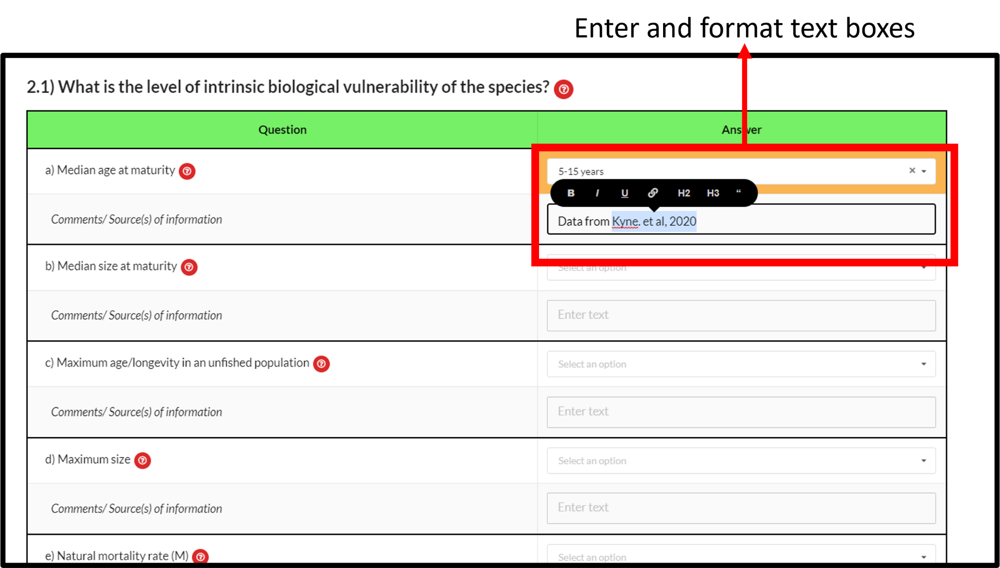
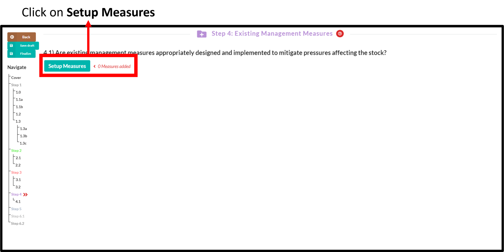
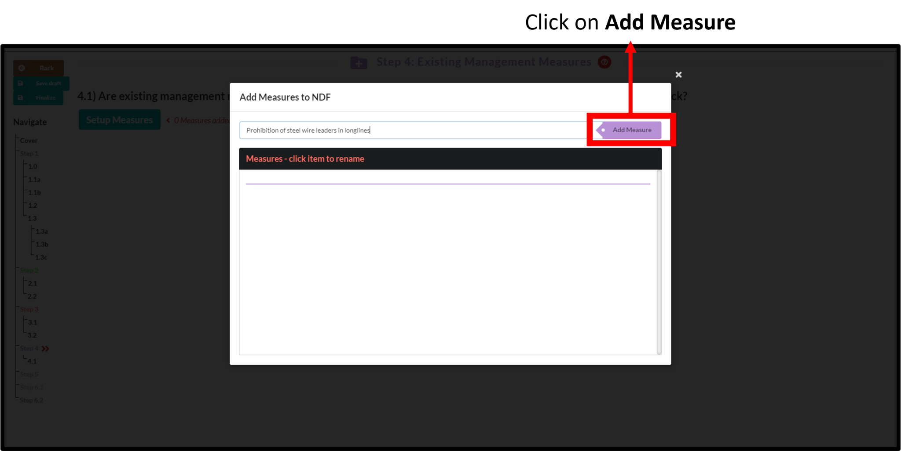
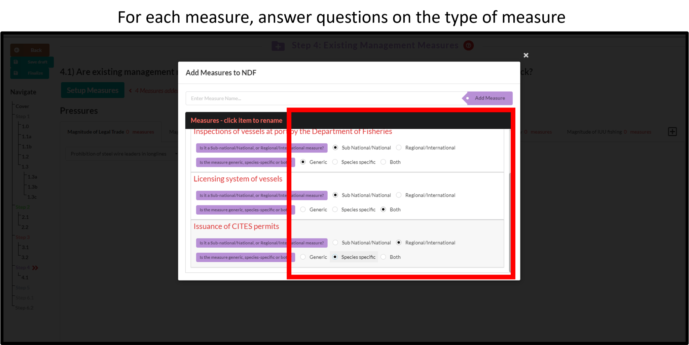
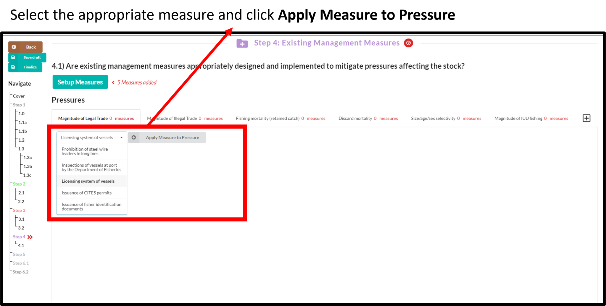
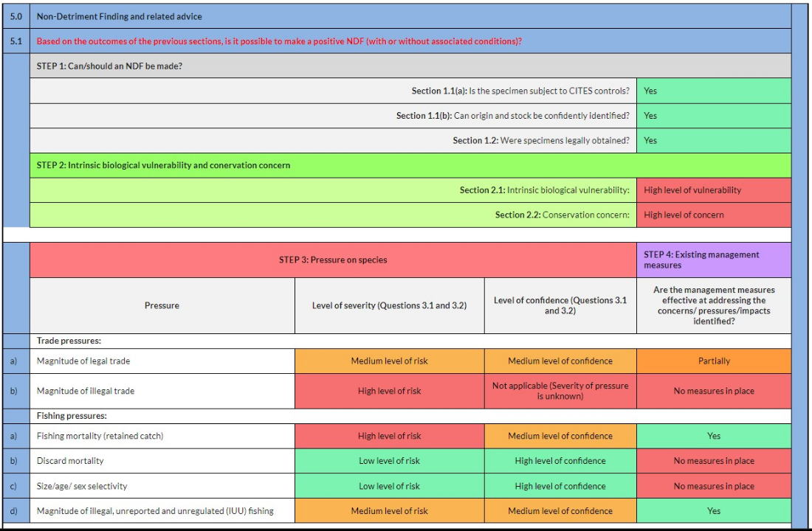

# (PART) Filling data into an Answerset {-}

# Tools available to facilitate users
The e-NDF has two inbuilt tools to assist users with filling an NDF.

## Help for questions 
This is abridged text from the [CITES Non-detriment Findings Guidance for Shark Species](https://cites.org/sites/default/files/eng/prog/shark/docs/Shark%20NDF%20guidance%20incl%20Annexes.pdf){target="_blank"} and is available for most questions.
```{r echo=FALSE, out.width='100%',fig.align='center'}

```

---

## Reference data from external databases 
The e-NDF currently displays reference data in Step 2 from [Sharkipedia.org](https://www.sharkipedia.org/){target="_blank"} and from [The IUCN Red List of Threatened Species](https://www.iucnredlist.org/){target="_blank"}.

**Note**: For reference data to be available, please click **Save and refresh** before moving to Step 2
```{r echo=FALSE, out.width='100%',fig.align='center'}

```

# Step 1 to Step 3
These steps are "question and answer" steps. Responses can be provided in two ways:

1. By selecting data from a [drop down menu](#dropdown)

2. By entering [text data](#textentry)

## Selecting from a drop down {#dropdown}
```{r echo=FALSE, out.width='100%',fig.align='center'}

```

---

## Entering text data {#textentry}
Text data can also be entered. When entering data, the user can format the text with bold, italics, underline etc. as needed.
```{r echo=FALSE, out.width='100%',fig.align='center'}

```

# Step 4

In Step 4, the effectiveness of existing management measures to mitigates pressures is evaluated.

The steps involved include

1. [Populating](#listmm) a list with existing management measures.

2. [Applying](#applymm) these measures to the trade and fishing pressures.

3. [Assessing](#assessmm) the effectiveness of each management measure to address the relevant pressure.

## List of existing management measures {#listmm}
### Click on **Setup measures**
```{r echo=FALSE, out.width='100%',fig.align='center'}

```

### Type the name of an existing measure and add it to the list
```{r echo=FALSE, out.width='100%',fig.align='center'}

```

### Continue to add more measure as needed
```{r echo=FALSE, out.width='100%',fig.align='center'}

```

### Answer each question related to the measure
```{r echo=FALSE, out.width='100%',fig.align='center'}

```

---

## Apply measures to pressures {#applymm}

### Select the relevant pressure from the tabs
```{r echo=FALSE, out.width='100%',fig.align='center'}

```

### Select the relevant measure and apply it to the pressure
Do this for all relevant pressure-measure combinations.
```{r echo=FALSE, out.width='100%',fig.align='center'}

```

---

## Assess effectiveness of measures {#assessmm}
Do this for all relevant pressure-measure combinations.
```{r echo=FALSE, out.width='100%',fig.align='center'}

```

# Step 5
This step summarises the results from all previous steps of the e-NDF. 
```{r echo=FALSE, out.width='100%',fig.align='center'}

```