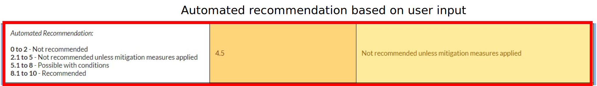
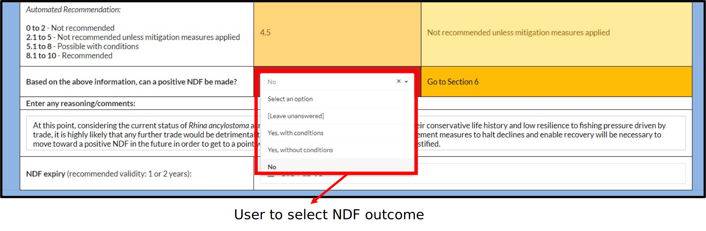
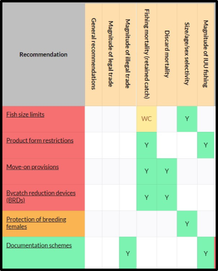
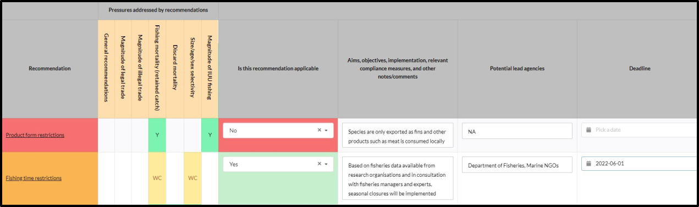
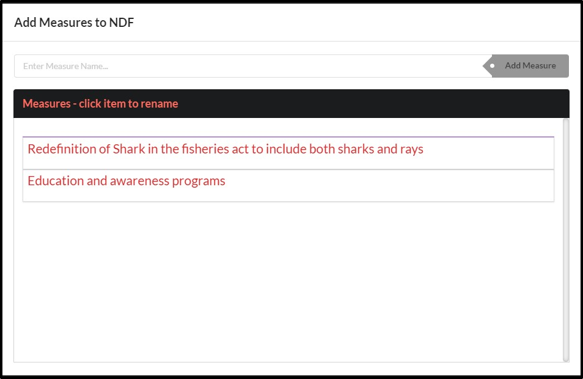
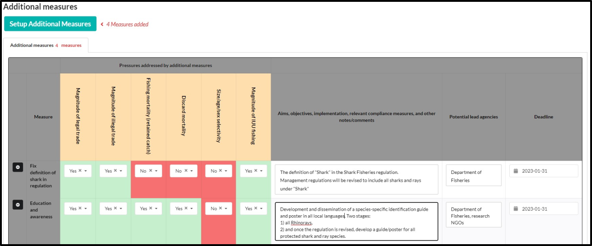

# (PART) Filling data into an Answerset {-}

# Tools available to facilitate users
The e-NDF has two inbuilt tools to assist users with filling an NDF.

## Help for questions 
This is abridged text from the [CITES Non-detriment Findings Guidance for Shark Species](https://cites.org/sites/default/files/eng/prog/shark/docs/Shark%20NDF%20guidance%20incl%20Annexes.pdf){target="_blank"} and is available for most questions.
```{r echo=FALSE, out.width='100%',fig.align='center'}
knitr::include_graphics('images/Help context.svg')
```

---

## Reference data from external databases 
The e-NDF currently displays reference data in Step 2 from [Sharkipedia.org](https://www.sharkipedia.org/){target="_blank"} and from [The IUCN Red List of Threatened Species](https://www.iucnredlist.org/){target="_blank"}.

**Note**: For reference data to be available, please click **Save and refresh** before moving to Step 2
```{r echo=FALSE, out.width='100%',fig.align='center'}
knitr::include_graphics('images/Referencedata.svg')
```

# Step 1 to Step 3
These steps are "question and answer" steps. Responses can be provided in two ways:

1. By selecting data from a [drop down menu](#dropdown)

2. By entering [text data](#textentry)

## Selecting from a drop down {#dropdown}
```{r echo=FALSE, out.width='100%',fig.align='center'}
knitr::include_graphics('images/Dropdown.svg')
```

---

## Entering text data {#textentry}
Text data can also be entered. When entering data, the user can format the text with bold, italics, underline etc. as needed.
```{r echo=FALSE, out.width='100%',fig.align='center'}
knitr::include_graphics('images/Textentry.svg')
```

# Step 4

In Step 4, the effectiveness of existing management measures to mitigates pressures is evaluated.

The steps involved include

1. [Populating](#listmm) a list with existing management measures.

2. [Applying](#applymm) these measures to the trade and fishing pressures.

3. [Assessing](#assessmm) the effectiveness of each management measure to address the relevant pressure.

## List of existing management measures {#listmm}
### Click on **Setup measures**
```{r echo=FALSE, out.width='100%',fig.align='center'}
knitr::include_graphics('images/Step4_1.svg')
```

### Type the name of an existing measure and add it to the list
```{r echo=FALSE, out.width='100%',fig.align='center'}
knitr::include_graphics('images/Step4_2.svg')
```

### Continue to add more measure as needed
```{r echo=FALSE, out.width='100%',fig.align='center'}
knitr::include_graphics('images/Step4_3.svg')
```

### Answer each question related to the measure
```{r echo=FALSE, out.width='100%',fig.align='center'}
knitr::include_graphics('images/Step4_4.svg')
```

---

## Apply measures to pressures {#applymm}

### Select the relevant pressure from the tabs
```{r echo=FALSE, out.width='100%',fig.align='center'}
knitr::include_graphics('images/Step4_5.svg')
```

### Select the relevant measure and apply it to the pressure
Do this for all relevant pressure-measure combinations.
```{r echo=FALSE, out.width='100%',fig.align='center'}
knitr::include_graphics('images/Step4_6.svg')
```

---

## Assess effectiveness of measures {#assessmm}
Do this for all relevant pressure-measure combinations.
```{r echo=FALSE, out.width='100%',fig.align='center'}
knitr::include_graphics('images/Step4_7.svg')
```

# Step 5
In step 5, the user is presented with a [summary](#summary) of all data entered in preceding steps of the NDF and the a [automated recommendation](#autorec) on the outcome of the NDF is provided. 

***The user can however [decide the outcome](#outcomedecision) of the NDF from the drop down menu.***

## Summary {#summary}
This section summarises the results from all preceeding steps of the e-NDF. 
```{r echo=FALSE, out.width='60%',fig.align='center'}
knitr::include_graphics('images/Step5_1.svg')
```

---

## Automated recommendation {#autorec}
An automated recommendation based on a scale of 1-10 is provided to the user based on the user inputs. 

***The user can however [decide the outcome](#outcomedecision) of the NDF from the drop down menu.***
```{r echo=FALSE, out.width='100%',fig.align='center'}

```

---

## Outcome decision {#outcomedecision}
The outcome of the NDF can be decided by the user by selecting from a drop down menu. Additional information including reasoning and an NDF expiry can also be set.

```{r echo=FALSE, out.width='100%',fig.align='center'}

```

Users can to proceed to Step 6 where additional management measures are suggested to improve the outcomes of future NDFs.

# Step 6

Step 6 involves the assessment of additional management measures (recommendations) to improve the status of the species, enabling the development of subsequent positive NDFs. This step is split into two parts:

1. [Step 6.1](#Step6.1) where ***automated*** recommendations are presented to the user

2. [Step 6.2](#Step6.2) where additional ***user defined*** recommendations can be entered

## Step 6.1 {#Step6.1}
In step 6.1, an ordered list of recommendations is presented to users. The ordering is as follows:

1. Recommendations that address pressures where the level of risk is high/unknown OR level of confidence is low OR management measures are not effective at addressing the pressure are shown first in <span style="background-color:#f57070">***red boxes***</span>.

2. Recommendations that address pressures where the level of risk is at most medium AND level of confidence is at most medium OR management measures are at most partially effective at addressing the pressure are shown later in  <span style="background-color:#fab452">***yellow boxes***</span>.

3. Recommendations that address pressures where the level of risk is low AND level of confidence is high AND management measures are effective at addressing the pressure are shown last in  <span style="background-color:#7cf3b0">***green boxes***</span>.

```{r echo=FALSE, out.width='40%',fig.align='center'}

```

The user can assess the applicability of each measure and enter information such as aims, objectives, potential lead agencies and deadlines for implementation.

```{r echo=FALSE, out.width='100%',fig.align='center'}

```

---

## Step 6.2 {#Step6.2}
In Step 6.2, the user is encouraged to include additional management measures (not included in Step 6.1) to manage the species.

This step is designed similar to step 4.

1. A list of additional management measures is populated

```{r echo=FALSE, out.width='100%',fig.align='center'}

```

2. The additional measures are applied to the NDF. The user can answer relevant questions related to the applicability of the measures to various pressures and recommendations to implement these measures along with a deadline. 

```{r echo=FALSE, out.width='100%',fig.align='center'}

```