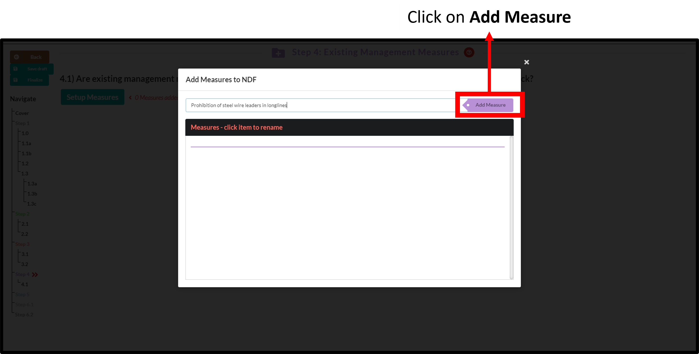
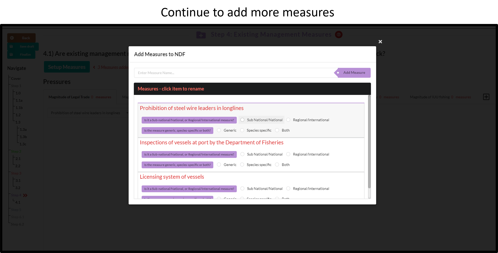
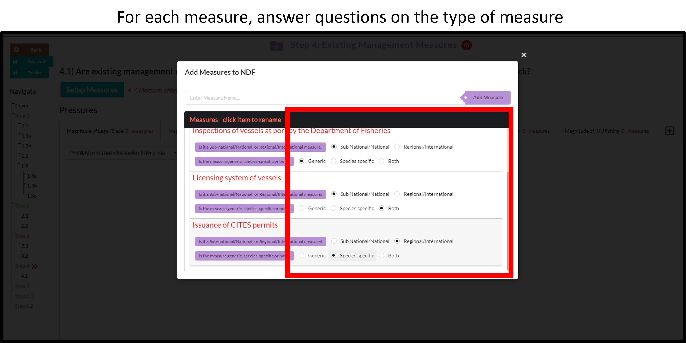
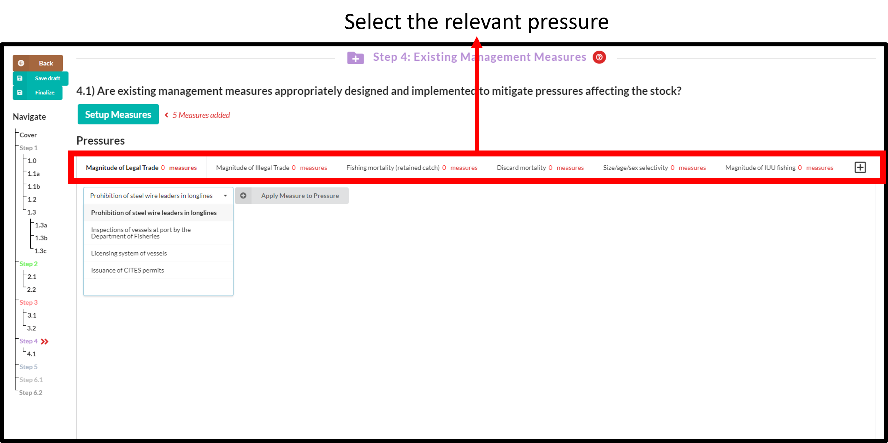
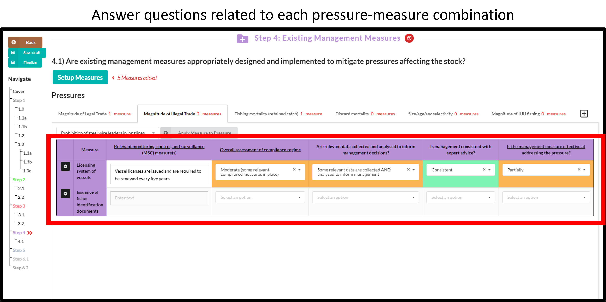

# (PART) Filling data into an Answerset {-}
# Step 1 to 3

# Step 4

In Step 4, the effectiveness of existing management measures to mitigates pressures is evaluated.

The steps involved include

1. [Populating](#listmm) a list with existing management measures.

2. [Applying](#applymm) these measures to the trade and fishing pressures.

3. [Assessing](#assessmm) the effectiveness of each management measure to address the relevant pressure.

## List of existing management measures {#listmm}
### Click on **Setup measures**
```{r echo=FALSE, out.width='80%',fig.align='center'}

```

### Type the name of an existing measure and add it to the list
```{r echo=FALSE, out.width='80%',fig.align='center'}

```

### Continue to add more measure as needed
```{r echo=FALSE, out.width='80%',fig.align='center'}

```

### Answer each question related to the measure
```{r echo=FALSE, out.width='80%',fig.align='center'}

```

---

## Apply measures to pressures {#applymm}

### Select the relevant pressure from the tabs
```{r echo=FALSE, out.width='80%',fig.align='center'}

```

### Select the relevant measure and apply it to the pressure
Do this for all relevant pressure-measure combinations.
```{r echo=FALSE, out.width='80%',fig.align='center'}

```

---

## Assess effectiveness of measures {#assessmm}
Do this for all relevant pressure-measure combinations.
```{r echo=FALSE, out.width='80%',fig.align='center'}

```