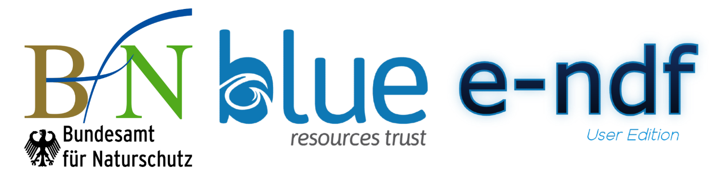

--- 
title: "User manual for e-NDF"
author: "Akshay Tanna"
date: "`r Sys.Date()`"
site: bookdown::bookdown_site
output:
  bookdown::html_book:
    theme: united
---
# Preface{-}

Here's a three-minute video that demonstrates the process:

(ref:workflow-video) Short video of our Bookdown workflow. View [on YouTube](https://youtu.be/8uFABzUG6Lw).

```{r workflow-video, fig.cap="(ref:workflow-video)", echo=FALSE}
if(knitr::is_html_output(excludes="markdown")) knitr::include_url("https://www.youtube.com/embed/8uFABzUG6Lw")
```


This document servers as a user manual for the [BfN-BRT CITES e-NDF](https://user.cites-endf.org). While information from the relevant guidance document is available using the clickable help files for there relevant step/section/question, this website is intended to serve as a document to assist users with using the functionality of the e-NDF.

The workflow for the e-NDF is illustrated below. Added as a trial.