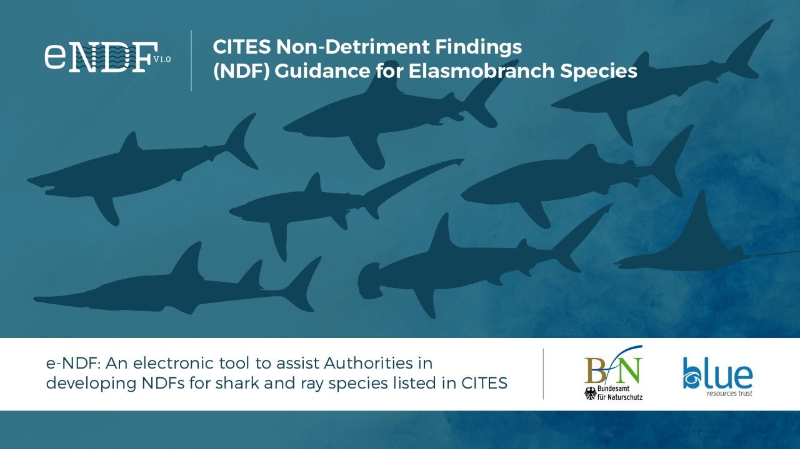

--- 
title: "User manual for the CITES e-NDF"
site: bookdown::bookdown_site
cover-image: "images/Cover.png"
output:
  bookdown::gitbook:
    includes:
      in_header: header.html
---
# Preface{-}
```{asis, echo=!knitr::is_latex_output()}
<p align="center">
  
</p>
```
This document servers as a user manual for the [BfN-BRT CITES e-NDF](https://user.cites-endf.org). While information from the relevant guidance document is available using the clickable help files for the relevant step/section/question, this website is intended to serve as a document to assist users with using the functionality of the e-NDF.

